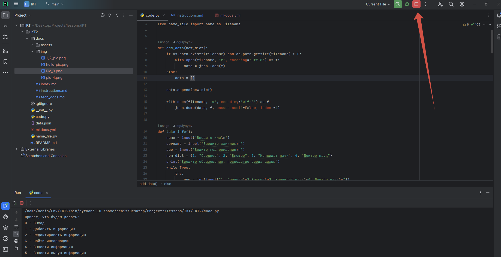
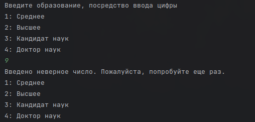
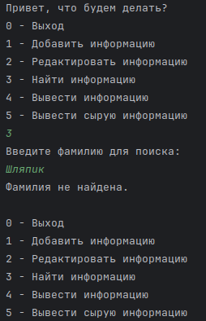

# Инструкция по применению

## Назначение программы

Данная программа предназначена для управления базой данных личных данных, включающей в себя информацию о различных людях. Программа позволяет пользователю добавлять новую информацию о человеке, включая его имя, фамилию, год рождения и уровень образования. Также предусмотрена функциональность для поиска, редактирования и вывода информации о конкретных лицах на основе фамилии. Возможности программы включают в себя:

1. Добавление информации о человеке в базу данных.
2. Редактирование существующей информации о человеке по фамилии.
3. Поиск информации о человеке по фамилии.
4. Вывод всей собранной информации о людях в удобном для чтения формате.
5. Вывод сырых данных в формате JSON для дальнейшего анализа или обработки.

Программа предназначена для использования в качестве удобного инструмента управления информацией о людях, обеспечивая легкий доступ к данным и их модификацию. Программа может быть полезна в различных областях, где требуется хранение и обработка личных данных, таких как учебные заведения, научные исследования, учет персонала и другие сферы деятельности.

## Условия выполнения программы

Для корректной работы программы необходимо обеспечить выполнение следующих условий:

1. **Операционная система**: Программа разработана для выполнения на операционных системах, поддерживающих Python, таких как Windows, Linux, macOS. Необходима поддержка выполнения Python-скриптов.

2. **Интерпретатор Python**: На компьютере должен быть установлен интерпретатор Python версии 3.x. Проверить наличие и версию Python можно, выполнив команду `python --version` или `python3 --version` в командной строке или терминале.

3. **Дополнительные библиотеки**: Для работы с JSON и обработки файлов необходимы стандартные библиотеки Python, входящие в стандартную поставку. Установка дополнительных внешних библиотек не требуется.

4. **Доступ к файловой системе**: Программа сохраняет данные в файле в формате JSON. Пользователь должен иметь права на чтение и запись файлов в директории выполнения программы или в указанном месте хранения файла данных.

5. **Ввод данных пользователем**: Программа предполагает интерактивный ввод данных пользователем через командную строку. Пользователь должен следовать инструкциям программы для ввода данных.

6. **Соблюдение формата данных**: При вводе информации пользователь должен соблюдать ожидаемые форматы данных (например, год рождения должен быть числом). Программа содержит проверки на корректность ввода, однако корректность и полнота введенных данных зависят от пользователя.

7. **Обработка ошибок**: В случае возникновения ошибок при чтении или записи файла данных, программа уведомит пользователя соответствующим сообщением. Пользователь должен обеспечить корректное разрешение возникших проблем (например, освободить место на диске или исправить права доступа к файлу).

## Выполнение программы

Процесс выполнения программы включает в себя следующие шаги:

1. **Запуск программы**: Программа запускается через командную строку или терминал, используя интерпретатор Python. Для запуска необходимо выполнить команду `python имя_файла.py`, где `имя_файла.py` — это название файла скрипта программы.

2. **Главное меню**: После запуска пользователь встречается с главным меню, предлагающим следующие опции действий:
   - `0 - Выход`: Завершение работы программы.
   - `1 - Добавить информацию`: Ввод данных о новом человеке и добавление их в базу данных.
   - `2 - Редактировать информацию`: Редактирование данных о человеке по фамилии.
   - `3 - Найти информацию`: Поиск информации о человеке по фамилии.
   - `4 - Вывести информацию`: Вывод всей информации из базы данных в удобочитаемом формате.
   - `5 - Вывести сырую информацию`: Вывод всей информации из базы данных в формате JSON.

3. **Выбор действия**: Пользователь вводит номер действия из главного меню. Программа предоставляет соответствующие инструкции или интерфейс для выполнения выбранного действия.

4. **Ввод и обработка данных**: В зависимости от выбранного действия, программа запрашивает у пользователя необходимые данные через командную строку и выполняет соответствующие операции (добавление, редактирование, поиск, вывод данных).

5. **Вывод результатов**: Программа выводит результаты действий пользователя. Это может быть подтверждение успешного выполнения операции, вывод найденной информации, отображение всей базы данных или сообщение об ошибке.

6. **Возврат в главное меню**: После выполнения действия и вывода результатов программа предлагает пользователю вернуться в главное меню для выбора следующих действий.

7. **Завершение работы программы**: Если пользователь выбирает опцию выхода (`0 - Выход`), программа завершает свою работу.

## Сообщения оператору

Программа предусматривает вывод различных сообщений оператору, далее - пользователю, чтобы обеспечить эффективное взаимодействие и информирование о текущем состоянии выполнения программы. Ниже приведены основные типы сообщений, которые могут быть представлены пользователю в процессе работы программы:

1. **Приветственное сообщение**: При запуске программы пользователю отображается приветственное сообщение с кратким описанием назначения программы и предложением выбрать действие из главного меню.

2. **Инструкции по выбору действия**: Для каждого действия в главном меню пользователю предоставляются детальные инструкции о том, какие данные необходимо ввести для выполнения выбранного действия.

3. **Подтверждение действий**: После выполнения определенных операций (например, добавление, редактирование данных) программа выводит сообщения о успешном выполнении действия.

4. **Ошибки ввода данных**: Если пользователь вводит данные неверного формата или выбирает несуществующий пункт меню, программа выводит сообщение об ошибке и предлагает повторить ввод.

5. **Сообщения о состоянии файла данных**: В случае, если файл данных не найден, поврежден или пуст, программа информирует пользователя соответствующим сообщением и предлагает способы решения проблемы.

6. **Результаты поиска**: При поиске информации программа сообщает о результатах поиска, включая сообщение о том, найдена информация или нет.

7. **Прощальное сообщение**: При выборе опции выхода из программы пользователю выводится прощальное сообщение с благодарностью за использование программы.

8. **Информационные сообщения**: В процессе работы программы могут выводиться дополнительные информационные сообщения, касающиеся специфики выполнения операций, советы по использованию программы и прочая полезная информация.

- Для начала работы откройте файл с кодом под названием `code.py`, на него указывает стрелка под номером `1`, и нажмите
на кнопку запуска кода, она указана стрелкой номер `2`
*Нажмите на картинку для увеличения*
  - На выбор вам предложат варианты действий, необходимо ввести соответсствующую цифру, от 0 до 5   
    
  `Если вы введёте что-то кроме цифры от 0 до 5 то программа сообщит об этом и попросит повторить ввод`  
  

- При выборе `0` - Программа завершит работу  

- `Так же вы можете завершить работу программы на любом этапе нажав на красный квадрат`  
*Нажмите на картинку для увеличения*

## Добавление структуры
- При выборе `1` - Программа начнёт заполнения новой структуры с данными о человеке. 
1. Первое что попросит вас ввести
программа это - `Имя`
2. Далее программа вас попросит ввести - `Фамилию`
3. После вас попросит ввести `Год рождения` (Желательно вводить в целочисленном формате, например - `1999`)
4. И в конце вас попросят ввести цифру от `1` до `4`, которая соответствует образованию и после ввода вас вернёт в
начальное меню выбора действий  
`Если вы введёте что то кроме цифры от 1 до 5 то программа сообщит что вы ввели неверное число и попросит попробовать ещё раз`  
  
`Если вы где то допустили ошибку, вы можете отредактировать структуру. Смотри раздел - Редактирование структуры`  
  
*Пример правильного ввода*

## Редактирование структуры
- При выборе `2` - Вы можете отредактировать выбранную структуру, поиск нужной структуры происходит по `Фамилии`
1. В начале вас попросят ввести `Фамилию` которая будет находится в структуре которую вы хотите отредактировать  
`Если структуры с данной Фамилией нет или вы ошиблись при вводе Фамилии, то программа сообщит что Фамилия не найдена и 
вернёт вас в основное меню выбора действий`  

2. Далее программа вас попросит ввести цифру соответствующую полю которое необходимо изменить, от `1` до `4`, в конце вы можете
ввести `0` чтобы завершить редактирование  
`При вводе некорректных данных программа сообщит о не верном выборе и попросит вас повторить ввод`  

3. При любом допустимом выборе вас попросят ввести соответствующие данные, при изменении образования инструкции такие же
как и при добавлении структуры (**Смотри** - *Добавление структуры* - пункт 4)  
  
*Пример корректного ввода и изменения информации*

## Поиск информации
- При выборе `3` - Вы можете найти структуру с необходимой вам фамилией
1. Здесь вас попросят ввести фамилию по которой будет производится поиск, после вывода программа выведет информацию 
о человеке, а затем вернёт вас в начальное меню выбора действий   
  
*Пример корректного ввода данных*  
`Если вы ввели Фамилию не правильно или данной Фамилии нет в списоке то прогармма сообщит что Фамилия не найдена и вернёт
вас в основное меню выбора действий` 

## Вывод всей информации
- При выборе `4` - Программа выведет список всех структур которые находятся в файле и вернёт вас в начальное меню выбора действий 
картинка  
  
*Пример работы функции*

## Вывод всей информации в сыром виде
- При выборе `5` - Программа выведет всё что написано в JSON файле без какой либо обработки  
  
*Пример работы функции*
