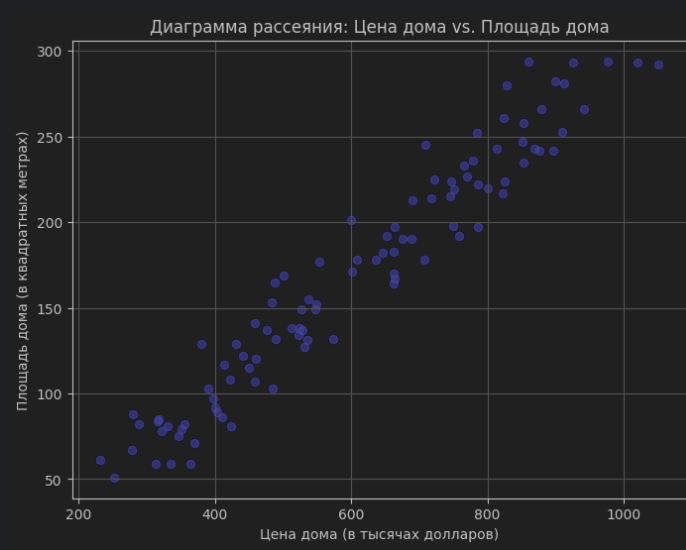
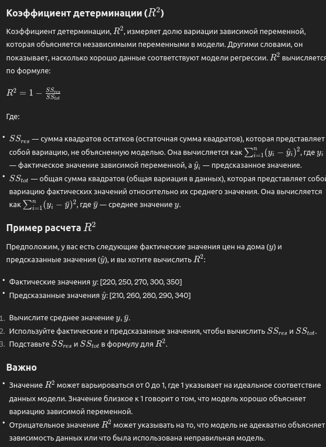

# Линейная регрессия

**Доклад о задаче линейной регрессии: Предсказание цены дома**

Хочу представить вам результаты моей работы по задаче линейной регрессии, связанной с предсказанием цены дома на основе его площади. Целью данного исследования было разработать модель, способную достаточно точно оценивать стоимость недвижимости на основе указанных параметров.

Для выполнения задачи, я использовал набор данных, который сгенерировал с помощью Python. В этом наборе данных содержится информация о площади дома в квадратных метрах и его цене в тысячах долларов. Для генерации данных я использовал следующий код на языке Python:

```python
import numpy as np

# Задаем случайное зерно для воспроизводимости результатов
np.random.seed(0)

# Генерируем данные
n = 100  # Количество наблюдений
X = np.random.randint(50, 300, n)  # Площадь дома в квадратных метрах
epsilon = np.random.normal(0, 50, n)  # Случайная ошибка
beta_0 = 100  # Коэффициент сдвига (пересечение)
beta_1 = 3  # Коэффициент наклона (угловой коэффициент)
Y = beta_0 + beta_1 * X + epsilon  # Цена дома в тысячах долларов
```

Этот код создает синтетические данные, которые можно использовать для обучения и тестирования модели линейной регрессии. Он использует numpy для генерации случайных данных о площади домов и добавляет случайную ошибку (epsilon) для имитации реальных условий, когда цены на дома не определяются исключительно их площадью. Коэффициенты beta_0 (сдвиг) и beta_1 (наклон) задают линейную зависимость между площадью дома и его ценой.

После генерации данных и подготовки массивов X и Y, я приступил к созданию графика для визуальной оценки наличия линейной зависимости между площадью дома и его ценой. Для этого использовал библиотеку matplotlib:


После визуального подтверждения наличия линейной зависимости, я приступил к разделению данных на обучающую и тестовую выборки. В соответствии со своими предпочтением, я использовал соотношение 80 на 20 без перемешивания данных. Для этого я разделил данные следующим образом - я прошёлся по списку и помещал каждые 8 элементов в обучающий список и оставшиеся 2 в тестовый. Перемешка не требовалась так как данные уже были сгенерированы в случайном порядке

Данный подход позволяет мне обучить модель на 80% данных и оценить ее производительность на оставшихся 20%. Теперь данные готовы для обучения модели линейной регрессии.

(Данную задачу можно решить с помощью специальной библиотеки, но я решил использовать аналитический метод и рассчитать вручную)
*Нажмите на картинку для увеличения*

После первоначальных ошибочных расчетов, я осуществил пересчет и получил следующие значения:

    Среднее значение X (средняя площадь дома): 171.06
    Среднее значение Y(средняя цена дома): 611.98
    Угловой коэффициент: 2.883 (При генерации значений коэффициент был - 3)
    Коэффициент сдвига: 118.8 (При генерации значений коэффициент был - 100)

Таким образом, получилась линейная регрессия вида: `y=118.8+2.883x`

После этого я приступил к проверке модели. Для этого я использовал тестовые данные и рассчитал предполагаемые цены на основе модели. Визуально предсказанные цены оказались достаточно близкими к фактическим значениям. Пример этого представлен ниже:

Тестовая выборка вместе с предсказанными значениями  
Числа представлены в таком виде, берём пример первой строчки: 261 - площадь дома, 823 - фактическая цена дома, 871 - предсказанная моделью цена  
Уже визуально можно понять что предсказанные цены достаточно близки к фактическим, за исключением некоторых элементов  

[((261, 823.3210874027753), 871.2629999999999),  
 ((71, 370.0521222921699), 323.493),  
 ((243, 813.8812433740342), 819.3689999999999),  
 ((280, 828.779819889379), 926.04),  
 ((122, 441.4425172049619), 470.526),  
 ((59, 312.63390828713915), 288.897),  
 ((132, 573.1858215235949), 499.356),  
 ((149, 526.8942555399957), 548.367),  
 ((82, 288.54621594915255), 355.206),  
 ((243, 869.2857276075474), 819.3689999999999),  
 ((213, 689.3871225032879), 732.8789999999999),  
 ((253, 909.5642659916903), 848.199),  
 ((183, 661.9867326621256), 646.389),  
 ((88, 279.93256785823564), 372.504),  
 ((81, 330.37662015643554), 352.323),  
 ((170, 661.9923393717356), 608.91),  
 ((61, 231.49905834788225), 294.663),  
 ((224, 746.1274067689972), 764.592),  
 ((220, 800.971751693474), 753.06),  
 ((134, 522.1428219346262), 505.122)]


Далее я решил оценить производительность модели, используя метрики, такие как среднеквадратичная ошибка (MSE) и коэффициент детерминации (R2). Эти метрики позволят нам оценить точность и эффективность нашей модели в сравнении с фактическими данными.

  


После расчета среднеквадратичной ошибки (MSE) получено значение 2644.87. MSE измеряется в квадратных единицах зависимой переменной, поэтому данное значение означает, что средняя квадратичная ошибка нашей модели составляет примерно 2644.87 квадратных единицы валюты. Чем меньше значение MSE, тем лучше модель соответствует данным.

Далее, для полной оценки эффективности модели, я решил посчитать коэффициент детерминации (R2). Этот коэффициент поможет нам понять, какую долю изменчивости зависимой переменной объясняет наша модель.

После расчета коэффициента детерминации R2, я получил значение 0.992. Это означает, что моя модель линейной регрессии объясняет около 99.2% изменчивости цены дома на основе их площади. Это очень высокий показатель и свидетельствует о том, что моя модель хорошо соответствует данным и обладает высокой предсказательной способностью.

Коэффициент детерминации близок к 1, что указывает на то, что моя модель объясняет почти всю изменчивость зависимой переменной. Это говорит о том, что моя модель линейной регрессии дает очень точные предсказания цены домов на основе их площади.

Итак, на основании проведенного анализа и вычислений можно сделать вывод, что моя модель линейной регрессии демонстрирует высокую эффективность и точность в предсказании цены домов на основе их площади. Полученные результаты говорят в пользу использования линейной регрессии в подобных задачах прогнозирования цен на недвижимость.

Линейная регрессия является мощным инструментом анализа данных, который широко применяется в различных областях, включая финансы, экономику, медицину и многие другие. Она позволяет выявлять зависимости между переменными и строить предсказательные модели на их основе, что делает ее важным инструментом для принятия решений и проведения анализа данных.

Хотя значение коэффициента детерминации R2, близкое к 1, может показаться идеальным результатом, важно также учитывать другие факторы, такие как размер набора данных, переобучение и реальность применения модели. В небольших наборах данных модель может легко "переобучиться", то есть слишком точно адаптироваться к данным обучающей выборки, что снижает ее способность к обобщению на новых данных. Поэтому важно тщательно анализировать результаты и проверять модель на других наборах данных, чтобы убедиться в ее надежности и способности к обобщению на новые ситуации.
